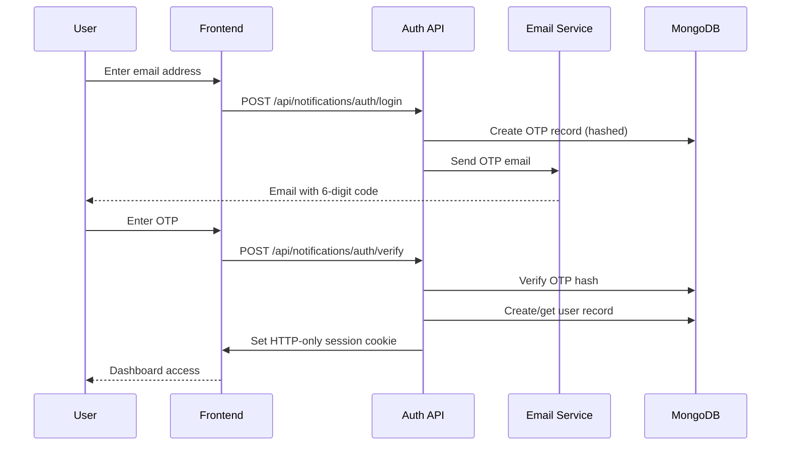
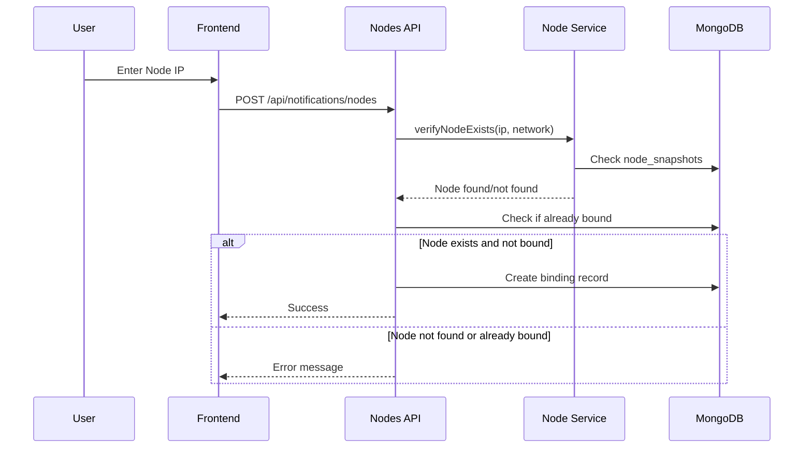
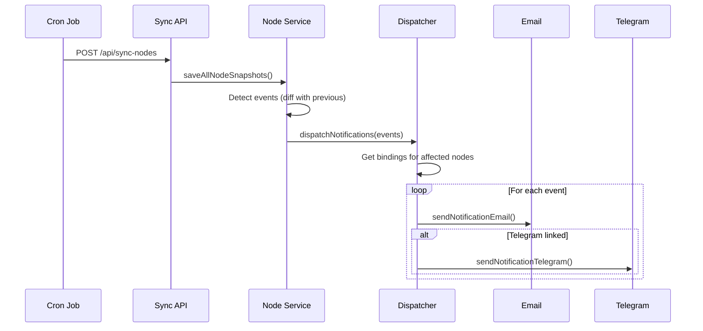

# Notification System Documentation

XanDash includes a real-time notification system that alerts node operators when their nodes experience important events. This document covers the complete architecture, setup, and technical implementation.

---

## Table of Contents

1. [Overview](#overview)
2. [Architecture](#architecture)
3. [Event Types](#event-types)
4. [Delivery Channels](#delivery-channels)
5. [User Flow](#user-flow)
6. [Technical Implementation](#technical-implementation)
7. [Database Schema](#database-schema)
8. [API Endpoints](#api-endpoints)
9. [Environment Variables](#environment-variables)
10. [Telegram Bot Setup](#telegram-bot-setup)

---

## Overview

The notification system automatically monitors node status changes and sends alerts via Email and Telegram. It's integrated with the existing cron sync job that runs every 5 minutes.

### Key Features

| Feature | Description |
|---------|-------------|
| **Dual-Channel Delivery** | Email (required) + Telegram (optional) |
| **Real-Time Events** | Status, version, credits, uptime changes |
| **Smart Filtering** | Only notifies on significant events |
| **One-Time Binding** | Each node can only be bound to one user |
| **Email OTP Auth** | Secure passwordless authentication |
| **Test Notifications** | Verify configuration before going live |

---

## Architecture


### Component Overview

| Component | File | Purpose |
|-----------|------|---------|
| **Dispatcher** | `notification-dispatcher.ts` | Routes events to delivery channels |
| **Email Service** | `email-service.ts` | Sends emails via Resend API |
| **Telegram Service** | `telegram-service.ts` | Sends messages via Telegram Bot |
| **User Service** | `user-service.ts` | Manages users, OTPs, bindings |
| **Session Service** | `session-service.ts` | JWT-based authentication |
| **Node Service** | `node-service.ts` | Detects events, triggers dispatch |

---

## Event Types

The system monitors and alerts on the following events:

| Event Type | Trigger Condition | Alert Message |
|------------|-------------------|---------------|
| `node_online` | Node comes back online | "Your node is back online" |
| `node_offline` | Node goes offline (>5 min) | "Your node has gone offline" |
| `status_change` | Status changes (online/offline/syncing) | "Status changed from X to Y" |
| `version_change` | Node software version updates | "Version updated from X to Y" |
| `uptime_reset` | Node restarts (uptime drops) | "Node restarted. Previous uptime: X" |
| `credits_zero` | Credits drop to exactly 0 | "Credits depleted. Previous: X" |

### Suppressed Events (Too Noisy)

These events are logged but **not** sent as notifications:
- `credits_change` - Incremental credit changes
- `storage_change` - Storage allocation changes
- `node_new` - New node detection

---

## Delivery Channels

### Email (Resend)

- **Required**: Every user must have an email
- **Provider**: [Resend.com](https://resend.com)
- **Templates**: Styled HTML emails with dark mode support
- **Types**: Login OTP, Node Alerts

### Telegram

- **Optional**: Users can link their Telegram
- **Bot**: [@XandashBot](https://t.me/XandashBot)
- **Features**: Rich formatting with emojis, inline links
- **Commands**: `/start`, `/list`, `/status`, `/help`

---

## User Flow

### 1. Authentication



### 2. Node Binding



### 3. Alert Dispatch



---

## Technical Implementation

### Event Detection Logic

Events are detected in `node-service.ts` by comparing current state with the last snapshot:

```typescript
// Status change detection
if (existingNode.status !== node.status) {
    events.push({
        event_type: node.status === 'online' ? 'node_online' : 'node_offline',
        previous_status: existingNode.status,
        new_status: node.status
    });
}

// Version change detection
if (existingNode.version !== node.version) {
    events.push({
        event_type: 'version_change',
        previous_version: existingNode.version,
        new_version: node.version
    });
}

// Credits zero detection
if (existingNode.credits > 0 && node.credits === 0) {
    events.push({
        event_type: 'credits_zero',
        previous_value: existingNode.credits,
        new_value: 0
    });
}
```

### Notification Filtering

Only specific events trigger notifications (see `shouldNotify()` function):

```typescript
export function shouldNotify(eventType: string): boolean {
    const notifiableEvents = [
        'node_online',
        'node_offline',
        'status_change',
        'version_change',
        'uptime_reset',
        'credits_zero',
    ];
    return notifiableEvents.includes(eventType);
}
```

### Session Management

Sessions use JWT tokens stored in HTTP-only cookies:

```typescript
// Session creation (session-service.ts)
const token = await new SignJWT({ email })
    .setProtectedHeader({ alg: 'HS256' })
    .setIssuedAt()
    .setExpirationTime('7d')
    .sign(secret);

cookies().set(COOKIE_NAME, token, {
    httpOnly: true,
    secure: process.env.NODE_ENV === 'production',
    sameSite: 'lax',
    maxAge: 60 * 60 * 24 * 7, // 7 days
});
```

---

## Database Schema

### Collections

| Collection | Network | Purpose |
|------------|---------|---------|
| `notification_users` | Shared | User accounts with email/telegram |
| `node_bindings` | Shared | User-to-node bindings |
| `otp_tokens` | Shared | Temporary OTP records |

### notification_users

```typescript
interface NotificationUser {
    email: string;              // Primary key (lowercase)
    telegramChatId?: string;    // Optional telegram link
    telegramVerified: boolean;  // Telegram OTP verified
    createdAt: Date;
    updatedAt: Date;
}
```

### node_bindings

```typescript
interface NodeBinding {
    email: string;              // User email
    nodeIp: string;             // Node IP address
    network: 'devnet' | 'mainnet';
    pubkey?: string;            // Node public key
    testUsed: boolean;          // Test notification used
    createdAt: Date;
}
```

### otp_tokens

```typescript
interface OTPToken {
    email: string;
    purpose: 'login' | 'telegram';
    otpHash: string;            // SHA-256 hashed OTP
    telegramChatId?: string;    // For telegram linking
    attempts: number;           // Max 5 attempts
    expiresAt: Date;            // 10 minute expiry
    createdAt: Date;
}
```

---

## API Endpoints

### Authentication

| Method | Endpoint | Description |
|--------|----------|-------------|
| POST | `/api/notifications/auth/login` | Request OTP email |
| POST | `/api/notifications/auth/verify` | Verify OTP, create session |
| POST | `/api/notifications/auth/logout` | Clear session |
| GET | `/api/notifications/auth/session` | Get current session |

### Node Management

| Method | Endpoint | Description |
|--------|----------|-------------|
| GET | `/api/notifications/nodes` | List user's bound nodes |
| POST | `/api/notifications/nodes` | Bind a new node |
| DELETE | `/api/notifications/nodes` | Unbind a node |
| POST | `/api/notifications/nodes/test` | Send test notification |

### Telegram

| Method | Endpoint | Description |
|--------|----------|-------------|
| POST | `/api/notifications/telegram/bind` | Request OTP to telegram |
| PUT | `/api/notifications/telegram/bind` | Verify telegram OTP |
| DELETE | `/api/notifications/telegram/bind` | Unlink telegram |

---

## Environment Variables

| Variable | Required | Description |
|----------|----------|-------------|
| `RESEND_API_KEY` | Yes | API key from resend.com |
| `RESEND_FROM_EMAIL` | No | Sender email (default: notifications@xandash.online) |
| `TELEGRAM_BOT_TOKEN` | No* | Bot token from @BotFather |
| `SESSION_SECRET` | Yes** | JWT signing secret (32+ chars) |
| `MONGODB_URI` | Yes | MongoDB connection string |
| `CRON_SECRET` | Yes | Auth secret for sync endpoint |

*Required for Telegram notifications
**Auto-generated in development, required in production

### Generating SESSION_SECRET

```bash
# Using Node.js
node -e "console.log(require('crypto').randomBytes(32).toString('hex'))"

# Using OpenSSL
openssl rand -hex 32
```

---

## Telegram Bot Setup

### 1. Create Bot

1. Message [@BotFather](https://t.me/BotFather) on Telegram
2. Send `/newbot` command
3. Choose a name (e.g., "XanDash Notifications")
4. Choose a username (e.g., "XandashBot")
5. Copy the token to `TELEGRAM_BOT_TOKEN`

### 2. Set Bot Commands

Send to @BotFather:
```
/setcommands
```

Then send:
```
start - Start the bot and get your Chat ID
id - Get your Chat ID
list - View your bound nodes
status - Get status summary
help - Show all commands
```

### 3. User Linking Flow

1. User visits xandash.online/notifications
2. Logs in with email
3. Clicks "Link Telegram"
4. Enters their Chat ID (from `/start` command)
5. Receives OTP via Telegram
6. Enters OTP on website
7. Telegram linked successfully

---

## Troubleshooting

### Email Not Received

1. Check `RESEND_API_KEY` is set
2. Verify domain is configured in Resend dashboard
3. Check spam folder
4. Verify OTP hasn't expired (10 min)

### Telegram Not Working

1. Verify `TELEGRAM_BOT_TOKEN` is set
2. Ensure user has started conversation with bot
3. Check bot isn't blocked by user
4. Verify Chat ID is correct

### Notifications Not Sending

1. Check if node is actually bound (MongoDB `node_bindings`)
2. Verify event type is notifiable (see `shouldNotify()`)
3. Check cron job is running (GitHub Actions)
4. Review Vercel logs for errors

---

## Security Considerations

| Measure | Implementation |
|---------|----------------|
| OTP Hashing | SHA-256 (never stored plain) |
| Session Tokens | JWT with 7-day expiry, HTTP-only cookies |
| Rate Limiting | Max 5 OTP attempts |
| Secret Protection | Environment variables only |
| No Logging | Secrets never logged to console |

---

## Related Documentation

- [Architecture Overview](./ARCHITECTURE.md)
- [Cron Setup Guide](./CRON_SETUP.md)
- [API Reference](./API_REFERENCE.md)
